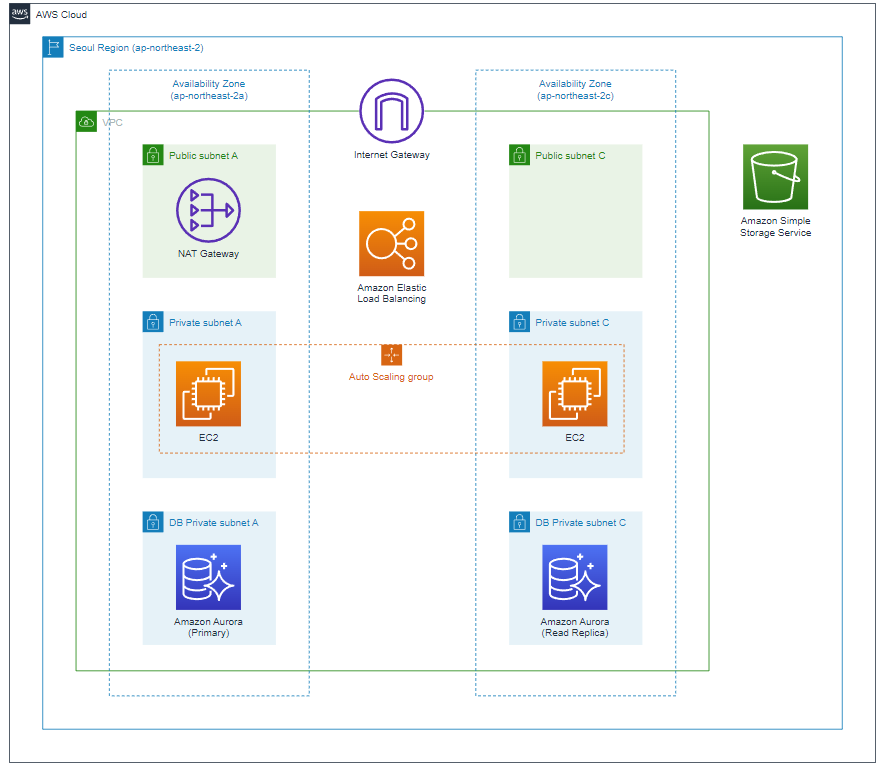
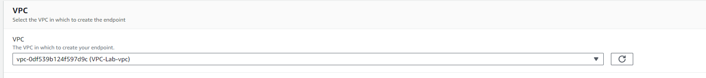
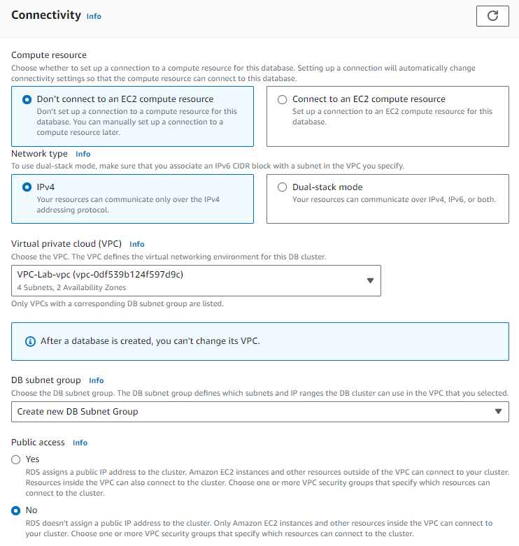

Building Multi-Tier, Highly Available, Fault-Tolerant Web Application

## Overview:

In this lab, you\'ll learn how to use AWS core services---**VPC, EC2,
RDS, and S3**---to build your own web application, following the
architecture outlined below.

{width="6.268055555555556in"
height="5.394444444444445in"}

You\'ll be building a highly available and scalable web application in
the following order.

1.  Select Region

2.  Create a VPC and Subnets

3.  Create an AMI for Web Application

4.  Create Application Load Balancer, Launch Template and Auto Scaling
    Group

5.  Test Load Balancing

6.  Test Auto Scaling by CPU Load

7.  Manually Auto Scaling

8.  Create Subnets for Database

9.  Create Aurora MySQL Cluster and set DB Connection

10. Create an AMI V2

11. Deploying New Instances using AMI V2 through Auto Scaling Group

12. Terminating modified Instances of AMI V1

13. Verifying modified Instances of AMI V2

14. Testing RDS Failover (Promote the Read Replica to a Master)

15. Verifying RDS failover and create a Snapshot for RDS

16. Static Web Hosting using S3

### Network -- Amazon VPC

-   In this lab, we\'ll create both a **Public Subnet** and a **Private
    Subnet** across two Availability Zones (AZ-a, AZ-c), as well as a
    **NAT Gateway** in the Public Subnet using the VPC Wizard.

-   After setting up these resources, you\'ll configure a **routing
    table** to manage network traffic flow.

-   These steps will help you establish a basic network configuration
    for a highly available and scalable web service environment.

-   The images provided in this document are designed to guide you
    through the hands-on tasks. Please note that the **identifiers
    (IDs)** for each element you create (such as VPC, NAT Gateway, EIP,
    etc.) will be unique to your user account.

{width="6.268055555555556in"
height="4.942361111111111in"}

#### Create VPC

1.  After logging in to the AWS console, select VPC from the service
    menu.

2.  click Create VPC to create your own VPC.

{width="6.143055555555556in"
height="2.928472222222222in"}

3.  To set up the environment for provisioning AWS resources in this
    lab, we\'ll create a VPC and Subnets.

4.  Go to the \"Create\" tab, select \"VPC and more\" under Resources,
    and change the name tag to \"VPC-Lab.\" Keep the default settings
    for the IPv4 CIDR block.

{width="6.002471566054243in"
height="3.1048950131233597in"}

5.  To design a highly available architecture, we\'ll create two subnet
    spaces and select AZs 2a and 2c for the customized Availability
    Zones.

6.  Set the CIDR value for the public subnet, which will allow direct
    communication with the Internet, as shown in the screen below.

7.  Then, configure the CIDR value for the private subnet as displayed
    in the screen.

{width="3.9670100612423447in"
height="6.725582895888014in"}

8.  A NAT gateway allows instances in your private subnets to connect to
    services outside your VPC while preventing external services from
    initiating direct connections to these instances.

9.  In this lab, we\'ll create a NAT gateway in just one Availability
    Zone.

10. For DNS options, make sure to enable both DNS hostnames and DNS
    resolution. Once you\'ve confirmed the settings, click the \"Create
    VPC\" button.

{width="5.067106299212599in"
height="4.975430883639545in"}

11. Once the VPC is created, you\'ll observe the process of setting up
    network-related resources, as shown in the screen below. Keep in
    mind that provisioning the NAT Gateway may take longer than the
    other resources.

{width="4.109025590551181in"
height="3.892330489938758in"}

12. You can review the details of the VPC you\'ve created, including the
    CIDR value, route table, network ACL, and other related information.
    Make sure that all the settings you configured are correct.

#### Create VPC Endpoint

1.  In VPC Dashboard, select Endpoints. Click Create endpoint button.

2.  Type s3 endpoint for name and select AWS services in Service
    category tab. In the search bar below, type s3 and select the list
    at the top.

{width="5.733333333333333in"
height="2.4340277777777777in"}

3.  For S3 VPC endpoints, there are gateway types and interface types.
    For this lab, select the gateway type. And for the deployment
    location, select the VPC-Lab-vpc created in this lab.

{width="5.784722222222222in"
height="0.7013888888888888in"}

4.  Choose a route table to reflect the endpoint. Select the two private
    subnets as shown below. Additional routing information for using the
    endpoint is automatically added to the selected route.

{width="5.593055555555556in"
height="2.325in"}

5.  Confirm that the route to access Amazon S3 through the gateway
    endpoint has been automatically added to the private route table
    specified earlier.

6.  In this section, you created a S3 gateway endpoint to allow private
    S3 access from within the VPC without needing an internet gateway.
    This keeps S3 traffic private within the AWS network.

### Compute -- Amazon EC2

Amazon Elastic Compute Cloud (Amazon EC2) is a web service that offers
secure and scalable compute capacity in the cloud. Designed to simplify
web-scale cloud computing for developers, Amazon EC2 features an
easy-to-use web interface that enables you to quickly obtain and
configure capacity. It gives you full control over your computing
resources, allowing you to operate within Amazon's reliable computing
environment.

This compute lab uses Auto Scaling Group to deploy web service instances
to private subnets in your VPC that you created earlier in this network
lab. This configures the highly available web services so that external
users can access the Sample Web Page through the web browser.

The following items are contained in this chapter.

-   Launch web server instances and execute user data

-   Set up a security group

-   Create a custom Amazon Machine Image (AMI)

-   Launch an Application Load Balancer (ALB)

-   Configure a Launch Template

-   Configure an Auto Scaling Group

-   Test auto scaling and change manual settings

#### Launch a web server instance

1.  In the AWS console search bar, type EC2 and select it. Then click
    EC2 Dashboard at the top of the left menu. Press the Launch instance
    button and select Launch instance from the menu.

2.  In Name, put the value Web server for custom AMI. And check the
    default setting in Amazon Machine Image below.

{width="5.625in"
height="4.684722222222222in"}

3.  Select t2.micro in Instance Type.

4.  For Key pair, choose Proceed without a key pair.

{width="6.217205818022747in"
height="4.050351049868766in"}

5.  Click the Edit button in Network settings to set the space where EC2
    will be located.

6.  And choose the VPC-Lab-vpc created in the previous lab, and for the
    subnet, choose public subnet. Auto-assign public IP is set to
    Enable.

{width="5.983850612423447in"
height="2.641895231846019in"}

7.  Right below it, create Security groups to act as a network firewall.
    Security groups will specify the protocols and addresses you want to
    allow in your firewall policy. For the security group you are
    currently creating, this is the rule that applies to the EC2 that
    will be created. After entering Immersion Day - Web Server in
    Security group name and Description, select Add Security group rule
    and set HTTP to Type. Also allow TCP/80 for Web Service by
    specifying it. Select My IP in the source.

{width="5.533812335958006in"
height="6.500563210848644in"}

8.  All other values accept the default values, expand by clicking on
    the Advanced Details tab at the bottom of the screen.

9.  Click the Meta Data version dropdown and select V2 only (token
    required)

10. Enter the following values in the User data field and select Launch
    instance.

{width="5.825in" height="3.1125in"}

11. Information indicating that the instance creation is in progress is
    displayed on the screen. You can view the list of EC2 instances by
    selecting View Instances in the lower right corner.

12. After the instance configuration is complete, you can check the
    Availability Zone in which the instance is running, and externally
    accessible IP and DNS information.

{width="6.268055555555556in"
height="2.8645833333333335in"}

13. Wait for the instance\'s Instance state result to be Running. Open a
    new web browser tab and enter the Public DNS or IPv4 Public IP of
    your EC2 instance in the URL address field. If the page is displayed
    as shown below, the web server instance is configured normally.

{width="5.708333333333333in"
height="2.1256944444444446in"}

#### Access the Webservice

1.  Go to the EC2 instance console. Select the instance you want to
    connect to and click the Connect button in the center.

{width="5.875in"
height="1.0666666666666667in"}

2.  In the Connect your instance window, select the EC2 Instance Connect
    tab, then click the Connect button in the lower right corner.

{width="6.268055555555556in"
height="6.03125in"}

3.  After a while, you can use the browser-based SSH console as shown
    below. Just close the window after the CLI test.

{width="6.017188320209974in"
height="2.141852580927384in"}

#### Create a Custom AMI

1.  In the EC2 console, select the instance that we made earlier in this
    lab, and click Actions \> Image and templates \> Create Image.

{width="5.908333333333333in"
height="1.2097222222222221in"}

2.  In the Create Image console, type as shown below and press Create
    image to create the custom image.

{width="5.792168635170603in"
height="5.792168635170603in"}

3.  Verify in the console that the image creation request in completed.

4.  In the left navigation panel, Click the AMIs button located under
    IMAGES. You can see that the Status of the AMI that you just
    created. It will show either Pending or Available.

{width="5.283333333333333in"
height="2.3666666666666667in"}

#### Terminate the instance

1.  In the left navigation panel of the EC2 dashboard, select Instances.
    Then select the instance that should be deleted. From there, click
    Instance state -\> Terminate instance.

{width="6.268055555555556in"
height="0.8409722222222222in"}

2.  When the alert message appears, click Terminate to delete.

3.  The instance status changes to Shutting down. After that, the
    instance status turned to terminated. The instance deletion is
    complete. You may see the instance for a short period of time for
    deletion logging.

#### Deploy auto scaling web service

Building on the network infrastructure from the Network - Amazon VPC
lab, we\'ll deploy a web service that automatically scales out/in under
load and ensures high availability. We\'ll use the web server AMI from
the previous chapter and the network setup named VPC-Lab.

#### Configure Application Load Balancer

In this lab, you will configure and set up the Application Load Balancer
to handle load balancing HTTP requests.

1.  From the EC2 Management Console in the left navigation panel, click
    Load Balancers under Load Balancing. Then click Create Load
    Balancer. In the Select load balancer type, click the Create.

2.  Name the load balancer. In this case, name as Web-ALB. Leave the
    other settings at their default values.

{width="5.741666666666666in"
height="2.9756944444444446in"}

3.  Scrolling down a little bit, there is a section for selecting
    availability zones. First, Select the VPC-Lab-vpc created
    previously. For Availability Zones select the 2 public subnets that
    were created previously. This should be Public Subnets.

{width="5.766666666666667in"
height="4.014583333333333in"}

4.  In the Security groups section, click the Create new security group
    hyperlink. Enter web-ALB-SG as the security group name and check the
    VPC information. Scroll down to modify the Inbound rules. Click the
    Add rule button and select HTTP as the Type and Anywhere-IPv4 as the
    Source. And create a security group.

{width="6.268055555555556in"
height="2.7131944444444445in"}

5.  Return to the load balancer page again, click the refresh button,
    and select the web-ALB-SG you just created. Remove the default
    security group.

{width="6.268055555555556in"
height="1.5152777777777777in"}

6.  In Listeners and routing column, click Create target group. Put
    Web-TG for Target group name and check all settings same with the
    screen below. After that click Next button.

{width="4.125357611548557in"
height="7.225626640419947in"}

7.  This is where we would register our instances. However, as we
    mentioned earlier, there are not instances to register at this
    moment. Click Create target group.

{width="5.816666666666666in"
height="2.8631944444444444in"}

8.  Again, move into the Load balancers page, click refresh button and
    select Web-TG. {width="5.758333333333334in"
    height="2.9479166666666665in"}

9.  And then Click Create load balancer.

> {width="5.7in"
> height="2.5506944444444444in"}

#### Configure Launch Template

With the ALB now created, it\'s time to place instances behind the load
balancer. To configure an Amazon EC2 instance for the Auto Scaling
Group, you can use a Launch Template, Launch Configuration, or EC2
Instance. In this workshop, we\'ll use a Launch Template to set up the
Auto Scaling group.

The Launch Template streamlines the instance creation process by
configuring all parameters at once, supporting Auto Scaling, spot
fleets, and both spot and on-demand instances. This approach helps
manage costs, enhances security, and reduces the risk of deployment
errors.

The Launch Template contains the necessary details, like AMI and
instance type, for Amazon EC2 to launch instances. The Auto Scaling
group uses this template to add new instances during a scaling-out
event. If you need to update the EC2 instance configuration, you can
create a new version of the Launch Template and assign it to the Auto
Scaling group. You also have the option to choose a specific version of
the template for launching EC2 instances, with the flexibility to change
this setting anytime.

#### Create Security Group

1.  From the left navigation panel of the EC2 console, select Security
    Groups under the Network & Security heading and click Create
    Security Group in the upper right corner.

2.  Scroll down to modify the Inbound rules. First, select the Add rule
    button to add the Inbound rules, and select HTTP in the Type. For
    Source, type ALB in the search bar to search for the security group
    created earlier Web-ALB-SG. This will configure the security group
    to only receive HTTP traffic coming from ALB.

3.  Leave outbound rules\' default settings and click Create Security
    Group to create a new security group. This creates a security group
    that allows traffic only for HTTP connections (TCP 80) that enter
    the instance via ALB from the Internet.

{width="6.268055555555556in"
height="2.7618055555555556in"}

#### Create Launch Template

1.  In the EC2 console, select Launch Templates from the left navigation
    panel. Then click Create Launch Template.

2.  Let\'s proceed with setting up the launch template step by step.
    First, set Launch template name and Template version description as
    shown below, and select Checkbox for Provide guidance in Auto
    Scaling guidance. Select this checkbox to enable the template you
    create to be utilized by Amazon EC2 Auto Scaling.

{width="6.268055555555556in"
height="3.7881944444444446in"}

3.  Scroll down to set the launch template contents. In Amazon Machine
    Image(AMI), set the AMI to Web Server v1, which was created in the
    previous EC2 lab. You can find it by typing Web Server v1 in the
    search section, or you can scroll down to find it in the My AMI
    section. Next, select t2.micro for the instance type. We are not
    going to configure SSH access because this is only for Web service
    server. Therefore, we do not use key pairs.

{width="5.207230971128609in"
height="6.494950787401574in"}

4.  Leave the other parts as default. Let\'s take a look at the Network
    Settings section. First, in Networking platform select Virtual
    Private Cloud(VPC). In security group section, find and apply
    ASG-Web-Inst-SG created before.

{width="5.925in"
height="3.066666666666667in"}

5.  Follow the Storage\'s default values without any additional change.
    Go down and define the Instance tags. Click Add tag and Name for Key
    and Web Instance for Value. Select Resource types as Instances and
    Volumes.

{width="5.858333333333333in"
height="5.721527777777778in"}

6.  Create an IAM instance profile for Systems Manager to create the
    SSMInstanceProfile IAM role.

-   Sign in to the AWS Management Console and open the IAM console . In
    the navigation pane, choose Roles, and then choose Create role.

-   Under Select type of trusted entity, choose AWS service. Immediately
    under Choose the service that will use this role, choose EC2, and
    then choose Next.

-   On the Attach permissions policies page, do the following: Use the
    Search field to locate the AmazonSSMManagedInstanceCore. Select the
    box next to its name. Choose Next.

-   For Role name, enter a name for your new instance profile, such as
    SSMInstanceProfile. Choose Create role. The system returns you to
    the Roles page.

7.  Finally, in the Advanced details tab, set the IAM instance profile
    to SSMInstanceProfile.

{width="5.925in"
height="2.563888888888889in"}

8.  Leave all other settings as default, and click the Create launch
    template button at the bottom right to create a launch template.

9.  After checking the values set in Summary on the right, click Create
    launch template to create a template.

#### Set Auto Scaling Group

1.  Enter the EC2 console and select Auto Scaling Groups at the bottom
    of the left navigation panel. Then click the Create Auto Scaling
    group button to create an Auto Scaling Group.

2.  In \[Step 1: Choose launch template or configuration\], specify the
    name of the Auto Scaling group. In this workshop, we will designate
    it as Web-ASG. Then select the launch template that you just created
    named Web. The default settings for the launch template will be
    displayed. Confirm and click the lower right Next button.

{width="5.708333333333333in"
height="4.059027777777778in"}

3.  Set the network configuration with the Purging options and instance
    types as default. Choose VPC-Lab-vpc for VPC, select Private subnet
    1 and Private subnet 2 for Subnets. When the setup is completed,
    click the Next button.

{width="5.9in"
height="4.795138888888889in"}

4.  Next, proceed to set up load balancing. First, select Attach to an
    existing load balancer. Then in Choose a target group for your load
    balancer, select Web-TG created during in ALB creation. At the
    Monitoring, select Check box for Enable group metrics collection
    within CloudWatch. This allows CloudWatch to see the group metrics
    that can determine the status of Auto Scaling groups.

{width="6.268055555555556in"
height="5.574305555555555in"}

5.  In the step of Configure group size and scaling policies, set
    scaling policy for Auto Scaling Group. In the Group size column,
    specify Desired capacity and Minimum capacity as 2 and Maximum
    capacity as 4. Keep the number of the instances to 2 as usual, and
    allow scaling of at least 2 and up to 4 depending on the policy.

6.  In the Scaling policies section, select Target tracking scaling
    policy and type 30 in Target value. This is a scaling policy for
    adjusting the number of instances based on the CPU average
    utilization remaining at 30% overall. Leave all other settings as
    default and click the Next button in the lower right corner.

{width="5.500476815398075in"
height="7.100615704286964in"}

7.  We will not Add notifications. Click the Next button to move to the
    next step. In the Add tags step, we will simply assign name tag.
    Click Add tag, type Name in Key, ASG-Web-Instance in Value, and the
    click next.

8.  Now we are in the final stage of review. After checking all
    settings, click the Create Auto Scaling Group button at the bottom
    right.

9.  Auto Scaling group has been created. You can see the Auto Scaling
    group created in the Auto Scaling group console as shown below.

10. Instances created through the Auto Scaling group can also be viewed
    from the EC2 Instance menu.

{width="5.925in"
height="1.0222222222222221in"}

#### Check web service and test

Now, let\'s test the service you have configured for successful
operation. First, let\'s check whether you can access the website
normally and whether the load balancer works, and then load the web
server to see if Auto Scaling works.

#### Check Web Service and Load Balancer

1.  To access through the Application Load Balancer configured for the
    web service, click the Load Balancers menu in the EC2 console and
    select the Web-ALB you created earlier. Copy DNS name from the basic
    configuration.

{width="5.95in"
height="2.7270833333333333in"}

2.  Open a new tab in your web browser and paste the copied DNS name.
    You can see that web service is working as shown below. For the
    figure below, you can see that the web instance placed in
    *us-east-1a* is running this web page.

{width="5.875in"
height="2.176388888888889in"}

3.  If you click the refresh button here, you can see that the host
    serving the web page has been replaced with an instance of another
    availability zone area (ap-northeast-2c) as shown below. This is
    because routing algorithms in ALB target groups behave Round Robin
    by default.

4.  Currently, in the the Auto Scaling group, scaling policy\'s baseline
    has been set to 30% CPU utilization for each instance.

    a.  If the average CPU utilization of an instance is less than 30%,
        Reduce the number of instances.

    b.  If the average CPU utilization of an instance is over 30%,
        Additional instances will be deployed, load will be distributed,
        and adjusted to ensure that the average CPU utilization of the
        instances is 30%.

{width="5.591666666666667in"
height="1.5798611111111112in"}

5.  Enter Auto Scaling Groups from the left side menu of the EC2 console
    and click the Monitoring tab. Under Enabled metrics, click EC2 and
    set the right time frame to 1 hour. If you wait for a few seconds,
    you\'ll see the CPU Utilization (Percent) graph changes.

{width="5.8in"
height="3.046527777777778in"}

6.  Wait for about 5 minutes (300 seconds) and click the Activity tab to
    see the additional EC2 instances deployed according to the scaling
    policy.

7.  When you click on the Instance management tab, you can see that two
    additional instances have sprung up and a total of four are up and
    running.

{width="5.825in"
height="2.2944444444444443in"}

8.  If you use the ALB DNS that you copied earlier to access and refresh
    the web page, you can see that it is hosting the web page in two
    instances that were not there before. The current CPU load is 0%
    because it is a new instance. It can also be seen that each of them
    was created in a different availability zone. If it\'s not 0%, it
    can look more than 100% because it\'s a constant load situation.

> {width="5.316666666666666in"
> height="1.975in"}

#### Database -- Amazon Aurora

> Among the many database options available on AWS, Amazon
> RDS(Relational Database Service) is a cloud-based database service
> that is easy to configure and operate and easy to scale. Amazon RDS is
> cost-effective, easy to adjust capacity, and reduces time-consuming
> management tasks, allowing users to focus more on their business and
> applications.

#### 

#### Create VPC security group

1.  On the left side of the VPC dashboard, select Security Groups and
    then select Create Security Group.

2.  Enter Security group name and Description as shown below. Choose the
    VPC that was created in the first lab. It should be named VPC-Lab.

3.  Scroll down to the Inbound rules column. Click Add rule to create a
    security group policy that allows access to RDS from the EC2 Web
    servers that you previously created through the Auto Scaling Group.
    Under Type, select MySQL/Aurora The port range should default
    to 3306. The protocol and port ranges are automatically specified.
    The Source type entry can specify the IP band (CIDR) that you want
    to allow acces to, or other security groups that the EC2 instances
    to access are already using. Select the security group(named
    ASG-Web-Inst-SG ) that is applied to the web instances of the Auto
    Scaling group in the Compute - Amazon EC2.

4.  When settings are completed, click Create Security Group at the
    bottom of the list to create this security group.

{width="6.268055555555556in"
height="1.1201388888888888in"}

#### Create RDS instance

1.  In the AWS Management console, go to the RDS (Relational Database
    Service) .

2.  Select Create Database in dashboard to start creating a RDS
    instance.

3.  You want to select the RDS instances\' database engine. In Amazon
    RDS, you can select the database engine based on open source or
    commercial database engine. In this lab, we will use Amazon Aurora
    with MySQL-compliant database engine. Select Standard Create in the
    choose a database creation method section. Set Engine type to Aurora
    (MySQL Compatible), Set Version to Aurora (MySQL 5.7) 2.11.4.

{width="5.600485564304462in"
height="7.025609142607174in"}

4.  Select Production in Template. Under Settings, we want to specify
    administrator information for identifying the RDS instances. Enter
    the information as it appears below.

{width="5.983333333333333in"
height="5.969444444444444in"}

5.  Under DB instance size select Memory Optimized class. Under
    Availability & durability select Create an Aurora Replica or reader
    node in a different AZ. Select db.r5.large for instance type.

{width="6.268055555555556in"
height="2.59375in"}

6.  Set up network and security on the Connectivity page. Select the
    VPC-Lab that you created earlier in the Virtual private cloud (VPC)
    and specify the subnet that the RDS instance will be placed in,
    public access, and security groups. Enter the information as it
    appears below.

{width="6.183869203849519in"
height="6.508897637795275in"}

{width="6.183869203849519in"
height="5.267122703412073in"}

7.  Scroll down and click Additional configuration. Set database options
    as shown below. Be aware of the uppercase and lowercase letters of
    Initial database name.

{width="6.2672101924759405in"
height="4.267036307961505in"}

8.  Subsequent items such as Backup, Entry, Backtrack, Monitoring, and
    Log exports all accept the default values, and press Create database
    to create a database.

9.  A new RDS instance is now creating. This may take more than 5
    minutes. You can use an RDS instance when the DB instance\'s status
    changed to Available.

{width="6.268055555555556in"
height="1.05in"}

#### Connect RDS with Web App server

The Web Server instance that you created in the previous computer lab
contains code that generates a simple address book to RDS. The Endpoint
URL of the RDS must be verified first in order to use the RDS on the EC2
Web Server.

#### Storing RDS Credentials in AWS Secrets Manager

The web server we built includes sample code for our address book. In
this lab, you specify which database to use in the sample code and how
to connect it. We will store that information in AWS Secrets Manager.

In this chapter, we will create a secret containing data connection
information. Later, we will give the web server the appropriate
permission to retrieve the secret.

1.  In the console window, open AWS Secrets Manager
    (https://console.aws.amazon.com/secretsmanager/ ) and click the
    Store a new secret button.

2.  Under Secret Type, choose Credentials for Amazon RDS database. Write
    down the user name and password you entered when creating the
    database. And under Database select the database you just created.
    Then click the Next button.

{width="5.750498687664042in"
height="7.142285651793526in"}

3.  Name your secret, mysecret. The sample code is written to ask for
    the secret by this specific name. Click Next.

4.  Leave Secret rotation at default values. Click Next.

5.  Review your choices. Click Store.

6.  You can check the list of secret values with the name mysecret as
    shown below.

{width="6.268055555555556in"
height="0.9201388888888888in"}

7.  Click mysecret hyperlink and find Secret value tab. And click
    Retrieve secret value button.

8.  Click Edit button, and check whether there is dbname and
    immersionday in key/value section. If they were not, click Add
    button, fill out the value and click save button.

{width="6.268055555555556in"
height="1.9659722222222222in"}

#### Access RDS from EC2

Now that you have created a secret, you must give your web server
permission to use it. To do this, we will create a Policy that allows
the web server to read a secret. We will add this policy to the Role you
previously assigned to the web server.

#### Allow the Web server to access the secret

1.  Sign in to the AWS Management Console and open the IAM console . In
    the navigation pane, choose Policies, and then choose Create Policy.

2.  Click Choose a service.

3.  Type Secrets Manager into the search box. Click Secrets Manager.

4.  Under Access level, click on the carat next to Read and then check
    the box by GetSecretValue.

{width="6.268055555555556in"
height="3.222916666666667in"}

5.  Click on the carat next to Resources. For this lab, select All
    resources. Click Next: Tags.

6.  Click Next: Review

7.  On the Review Policy screen, give your new policy the name
    ReadSecrets. Click Create policy.

8.  In the navigation pane, choose Roles and type SSMInstanceProfile
    into the search box. This is the role you created previously in
    Connect to your Linux instance using Session Manager. Click
    SSMInstanceProfile.

9.  Under Permissions policies, click Attach policies.

10. Search for the policy you created called ReadSecrets. Check the box
    and click Attach policy.

11. Under Permissions policies, verify that AmazonSSMManagedInstanceCore
    and ReadSecrets are both listed.

{width="6.268055555555556in"
height="2.7555555555555555in"}

#### Try the Address Book

1.  Access the \[EC2 Console\]
    (https://console.aws.amazon.com/ec2/v2/home?instanceState=running )
    window and click load balancer. After copying the DNS name of the
    load balancer created in the compute lab, open a new tab in your
    browser and paste it.

{width="6.268055555555556in"
height="2.9819444444444443in"}

2.  After connecting to the web server, go to the RDS tab.

3.  Now you can check the data in the database you created.

This is a very basic exercise in interacting with a MySQL database
managed by AWS. RDS can support much more complex relational database
scenarios, but hopefully this simple example will make the point clear.
You are free to add/edit/delete content from the RDS database using the
Add Contact, Edit and Remove links in the address book.

#### Storage -- Amazon S3

Amazon Simple Storage Service (S3) provides a web service-based
interface that simplifies data processing anytime, anywhere.

This lab is designed to help users learn how to save, check, move, and
delete data using S3. You can also see the ability to host simple static
web pages using S3\'s static website hosting functionality.

#### Create Bucket on S3

1.  From the AWS Management Console, connect to S3 . Press Create bucket
    to create a bucket.

2.  Enter a unique bucket name in the Bucket name field. For this lab,
    type immersion-day-user_name, substituiting user-name with your
    name. All bucket names in Amazon S3 have to be unique and cannot be
    duplicated. In the Region drop-down box, specify the region to
    create the bucket. In this lab, select the region closest to you.
    The images will show the Asia Pacific (Seoul) region. Object
    Ownership change to ACLs enabled. Bucket settings for Block Public
    Access use default values, and select Create bucket in the lower
    right corner.

{width="6.268055555555556in"
height="5.711111111111111in"}

3.  A bucket has been created on Amazon S3.

{width="6.268055555555556in"
height="1.5708333333333333in"}

#### 

#### Adding objects to buckets

If the bucket has been created successfully, you are ready to add the
object. Objects can be any kind of file, including text files, image
files, and video files. When you add a file to Amazon S3, you can
include information about the permissions and access settings for that
file in the metadata.

#### Adding Objects for static Web hosting

1.  Keep the image file aws.png and save it .

2.  Write index.html using the source code below.

{width="6.268055555555556in"
height="2.342361111111111in"}

3.  Upload the aws.png file to S3. Click S3 Bucket that you just
    created.

4.  Click the Upload button. Then click the Add files button. Select the
    pre-downloaded aws.png file through File Explorer. Alternatively,
    place the file in Drag and Drop to the screen.

5.  Check the file information named aws.png to upload, then click the
    Upload button at the bottom.

6.  Check the URL information to fill in the image URL in index.html
    file. Select the uploaded aws.png file and copy the Object URL
    information from the details on the right.

7.  Paste Object URL into the image URL part of the index.html. Then
    specify the ALB DNS Name of the load balancer created by Deploy auto
    scaling web service to redirect to ALB when you click on the image.

{width="6.268055555555556in"
height="2.009027777777778in"}

8.  Upload the index.html file to S3 following the same instructions as
    you did to upload the image.

9.  If you check the objects in your S3 bucket, you should see 2 files.

#### View objects

1.  In the Amazon S3 Console, please click the object you want to see.
    You can see detailed information about the object as shown below.

2.  Return to the previous page and select the Permissions tab in the
    bucket. To modify the application of Block public access (bucket
    settings), press the right Edit button.

3.  Uncheck box and press the Save changes button.

4.  Enter confirm in the bucket\'s Edit Block public access pop up
    window and press the Confirm button.

5.  Click the Objects tab, select the uploaded files, click the Action
    drop-down button, and press the Make public button to set them to
    public.

{width="6.268055555555556in"
height="2.216666666666667in"}

6.  When the confirmation window pops up, press the Make public button
    again to confirm.

7.  Return to the bucket page, select index.html, and click the Object
    URL link in the Show Details entry.

8.  When you access the HTML object file object URL, the following
    screen is printed.

{width="6.268055555555556in"
height="3.4930555555555554in"}

9.  When you click on an image, it is redirected to the instance\'s web
    page you created.

#### Enable Static Web Site Hosting

A static website refers to a website that contains static content (HTML,
image, video) or client-side scripts (Javascript) on a web page. In
contrast, dynamic websites require server-side processing, including
server-side scripts such as PHP, JSP, or ASP.NET. Server-side scripting
is not supported on Amazon S3. If you want to host a dynamic website,
you can use other services such as EC2 on AWS.

1.  In the S3 console, select the bucket you just created, and click the
    Properties tab. Scroll down and click the Edit button on Static
    website hosting.

2.  Activate the static website hosting function and select the hosting
    type and enter the index.html value in the Index document value,
    then click the save changes button.

3.  Click Bucket website endpoint created in the Static website hosting
    entry to access the static website. This allows you to host static
    websites using Amazon S3.

{width="6.268055555555556in"
height="1.1430555555555555in"}
